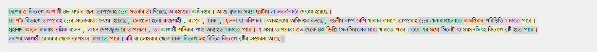

# Bangla Tokenizer
## Overview
This repository contains a tokenizer that has been trained on a diverse dataset comprising 20GB of text data. The primary focus of the data is Bangla, with some English text intentionally left in to facilitate future expansions. The tokenizer aims to provide robust tokenization for Bangla texts (English will be added very soon), making it an essential tool for various natural language processing (NLP) tasks, particularly for those working with limited data resources.

Additionally, alongside the tokenizer, a tokenizer visualizer has been developed. This visualizer generates tokenization results in HTML format, allowing users to view the tokenization output directly in their web browsers. It provides an intuitive way to inspect the tokenization process and can even accept custom models for comparison.

## Motivation
The main motivation behind creating this tokenizer is to contribute to the open-source community and assist those who may not have access to large datasets. Tokenization is a crucial step in NLP, and incorrect tokenization can significantly impact the performance of subsequent models. For instance, with limited training data, Bangla words might be incorrectly split, such as "আমার" being tokenized as "আম+ ার", which is not desirable. This tokenizer will help to mitigate such issues by leveraging a large dataset to generalize tokenization and ensure accurate results.

Furthermore, it's essential to note that tokenizers trained on small datasets may struggle to handle unknown Bangla words properly. However, this tokenizer, trained on a large amount of data, excels in handling such scenarios, enhancing its utility and reliability in real-world applications.

## Requirements
sentencepiece <br>
matplotlib

## Usage
``` python
import sentencepiece as spm

# Load the tokenizer model
tokenizer = spm.SentencePieceProcessor()
tokenizer.load('bn_tokenizer/tokenizer.model.model')

# Sample text
input_text = 'বাংলা টোকেনাইজার যা 20 গিগাবাইট টেক্সট ডেটার উপর প্রশিক্ষিত এবং ১০০ হাজার টোকেন রয়েছে'

# Encode the text
encoded_tokens = tokenizer.encode(input_text)

# Decode and print tokens separately
decoded_tokens = [tokenizer.decode([token]) for token in encoded_tokens]
print(decoded_tokens)
# output
['বাংলা', 'টোকেন', 'াইজার', 'যা', '20', 'গিগাবাইট', 'টেক্সট', 'ডেটা', 'র', 'উপর', 'প্রশিক্ষিত', 'এবং', '১০০', 'হাজার', 'টোকেন', 'রয়েছে']
```
### Visualize Tokenizer
Run 
```
python visualize_token.py
```
It will produce a `token_visualize.html` file, now open the `token_visualize.html` file on browser. The output will be like



### Visualize Tokenizer on Notebook
To visualize the tokenizer on notebook, open notebook and run
```python
from tokenizer_viz import TokenVisualization
from IPython.display import HTML
import sentencepiece as spm

# Load the tokenizer model
tokenizer = spm.SentencePieceProcessor()
tokenizer.load('bn_tokenizer/tokenizer.model.model')

# Initialize the TokenVisualization class with the encoder and decoder functions
token_viz = TokenVisualization(
    encoder=get_encoder,
    decoder=get_decoder
)

# Define a sample text to visualize tokenization boundaries
sample_text = "বাংলা টোকেনাইজার যা 20 গিগাবাইট টেক্সট ডেটার উপর প্রশিক্ষিত এবং ১০০ হাজার টোকেন রয়েছে"

# Visualize the tokenization boundaries
html = token_viz.visualize(sample_text)
HTML(html)
```

## Future Work
Expand English Dataset: Integrate an additional 50GB of English text data to get English tokenization capabilities. Right now there are some english but not good for standard english tokenization.

## Contact
For any queries or suggestions, please open an issue on this repository or contact me at hassanzahin@gmail.com or knock me at [linkedin](https://www.linkedin.com/in/hassan-ali-emon/)
